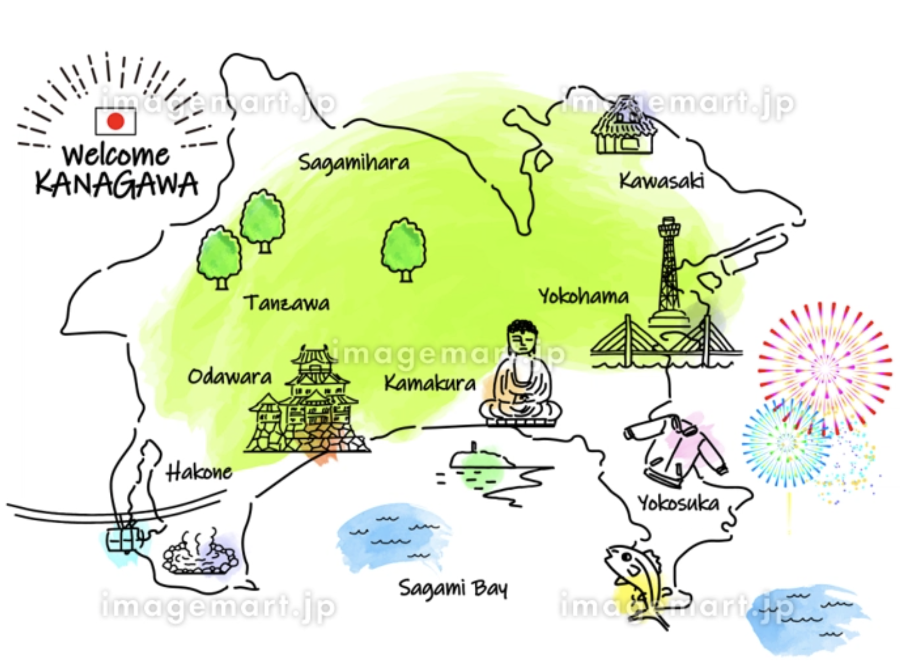

## 準備

- [x] やりたいこと発見！？会話の練習どうしてる？って話から派生
- [x] 何やる？→アニメを紹介するの楽しそう💡
- [x] 心配事シェアして相談→気軽に準備なくても楽しめるのがいいね
- [x] 時差を整理
- [x] 日程調整
- [x] 集合日決定
- [x] スライド準備

## 当日

【目標】会話を気軽に楽しく感じ合い、好きなアニメを紹介することを通して今後の交流へと発展させる

【目的】日本語の習得レベルの調整
1. 話している内容を文字にして表示すると理解できる？
2. 画像を提示するだけで会話ができる？
3. 音声だけで会話ができる？

Dr.Stone解説記事： https://www.mottainaihonpo.com/kaitori/contents/cat02/018-drstone-omoshiroi.html

[[textSp]]：レベル１
[[onlySpeak]]：レベル２

## 発表原稿

アイスブレイキング：~19:10

### 1. 自己紹介

- 私の名前は`ほろみ`です。
- 住んでいる国は`日本`です。
  東京のとなりにある`神奈川県`に住んでいます。
- 趣味は`1人で考え事をする`ことです。
  ブログを書いたり、本を読んだり、ドラマやアニメを見たり、編み物をしたり、手帳を書いたりするのが好きです。
  最近、ピアノを再開しました🎉Jazzの本を買って勉強しているところです。
- 苦手な食べ物は`わさび`です。

~19:15
4人終了：19:30
#### 2. horomiのおすすめアニメ

##### 最近見たアニメ

- よふかしのうた
- 葬送のフリーレン
- 薬屋のひとりごと
- リラックマとカオルさん
- バキ
- 四畳半タイムマシーンブルース
- Dr.STONE
- 不思議の国のアリス：字幕英語
	- セリフが短いからわかりやすい

##### 特におすすめしたいアニメ

Dr.STONEです🔥

https://dr-stone.jp/

##### 見どころ

- 仮説と検証の様子が具体的！めっちゃ地味だけどすごい
- 生活に役立つ科学を知れる
- 文明や社会について考えたくなる
- 嫌なやつが今の所いない
  - 協力するって大切だなと思う
- 鎌倉とか箱根とか神奈川県の地域が出てくるのが嬉しい

##### 場所を確認\_１

神奈川県は東京都の下にある！！

##### 位置を確認\_2

鎌倉は真ん中の下にある！横浜はその右上にある！！
箱根は左の下端にある！！全部海が目の前！！

### おわりに

是非見てみてね(^\_−)−☆

発明まとめ： https://youtu.be/lTv2_l88tIo?si=4qgvHgrYiId_Utc2

19:40には終わりたい...
4人終了：19:55

