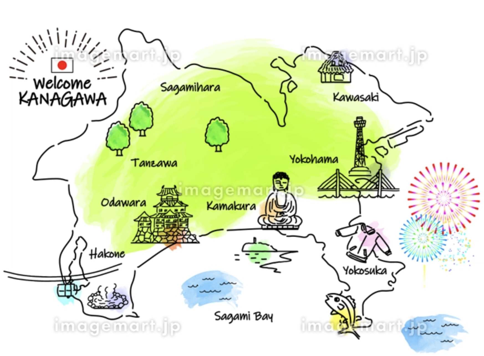

# もくじ

- 日本語で簡単に自己紹介をしよう
- 私もおすすめアニメを発表する
- 言葉で遊ぼう\_ヒンドゥ語(ユグ先生)

```
順番：horomi → あきと → ジュリアン → ユグ
```
#

# 特におすすめアニメ

Dr.STONE🔥


https://dr-stone.jp/

# 関東の地図


# 神奈川県の地図



# おわりに

是非見てみてね(^\_−)−☆


発明まとめ： https://youtu.be/lTv2_l88tIo?si=4qgvHgrYiId_Utc2

