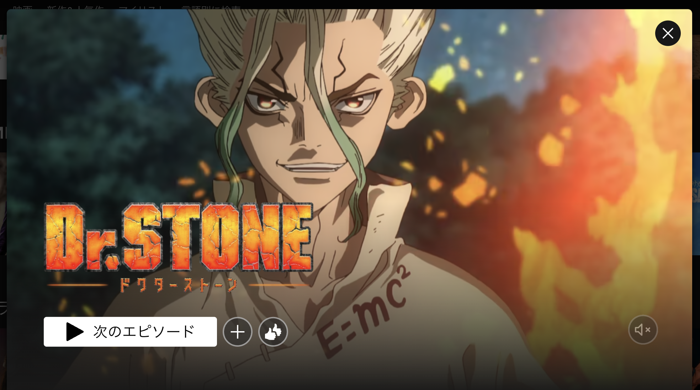
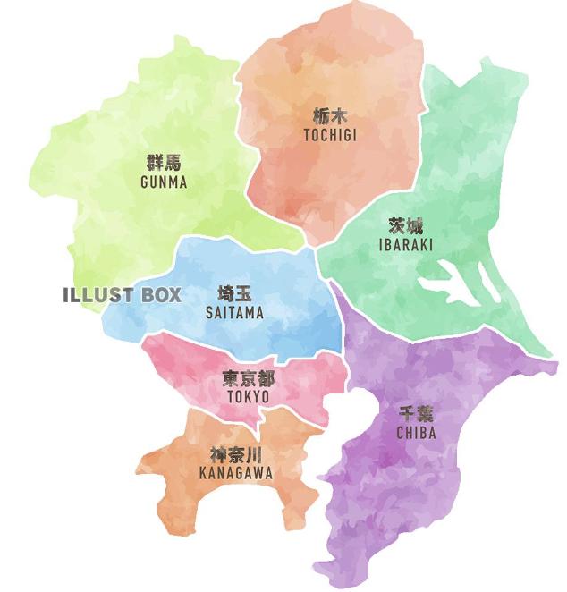

# 本日のもくじ

- 日本語で簡単に自己紹介をしよう
- 私もおすすめアニメを発表する
- 言葉で遊ぼう\_ヒンドゥ語(ユグ先生)

```
順番：horomi → あきと → ジュリアン → ユグ
```

# horomiの自己紹介

- 私の名前は`ほろみ`です。
- 住んでいる国は`日本`です。
  東京のとなりにある`神奈川県`に住んでいます。
- 趣味は`1人で考え事をする`ことです。
  ブログを書いたり、本を読んだり、ドラマやアニメを見たり、編み物をしたり、手帳を書いたりするのが好きです。
  最近、ピアノを再開しました🎉Jazzの本を買って勉強しているところです。
- 苦手な食べ物は`わさび`です。

# horomiのおすすめアニメ

Dr.STONEです🔥



https://dr-stone.jp/

# 見どころ


- めっちゃ地味だけどすごい
- 生活に役立つ科学を知れる
- 文明や社会について考えたくなる
- 嫌なやつが今の所いない
  - 協力するって大切だなと思う
- 鎌倉とか箱根とか神奈川県の地域が出てくるのが嬉しい

# 場所を確認\_１


神奈川県は東京都の下にある！！

# 位置を確認\_2


鎌倉は真ん中の下にある！
横浜はその右上にある！！
箱根は左の下端にある！！
全部海が目の前！！

# おわりに


是非見てみてね(^\_−)−☆

発明まとめ： https://youtu.be/lTv2_l88tIo?si=4qgvHgrYiId_Utc2
